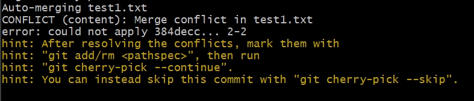
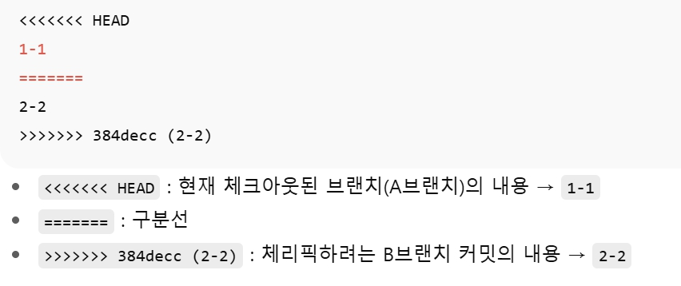

- **Cherry-pick시 발생할 수 있는 오류**
   - **Merge Conflict**
      - 서로 다른 브랜치에서 같은 파일 동일 라인을 다른 내용으로 수정 후 커밋한 경우 
        1. A브랜치에서 test1.txt의 첫번째 라인의 내용 "1-1"로 수정 후 커밋
        2. B브랜치에서 test1.txt의 첫번째 라인의 내용 "2-1"로 수정 후 커밋
        ```bash
        git cherry-pick 384decc5ecba604217353478e46efb5aeb38e0fd
        ```
        B브랜치의 커밋아이디를 A브랜치에서 Cherry-pick 시 conflict 발생    
        <br>
           

        <font color=red>서로다른 브랜치에서 같은 파일 같은 라인을 커밋해서 에러발생 </font>
        <br>

        #### <font color=green> * 이런 경우 파일을 수작업으로 정리해줘야 함</font>
          
         
         서로 다른 브랜치의 파일의 수정내용 
          1-1, 2-2를 어느 내용으로 합칠 건지 정해야 함.
          <br>
          1. 1-1만 남기고 지울 건지, 2-2만 남길건지 
          2. 1-1, 2-2를 모두 남길건지
          3. 1,2중 결정이 되면
             파일에서 conflict 마커(<<<<<<<, =======, >>>>>>>)를 모두 삭제하고 원하는 최종 상태만 남김.
          4. 아래 git 명령을 수행하여 최종 커밋처리
          ```bash
          git add 파일명
          git commit     # Cherry-pick중이면 메시지 자동생성됨
          ```   
    - **Dependancy**      