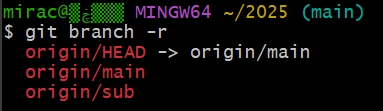
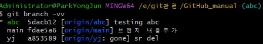
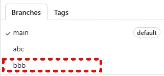
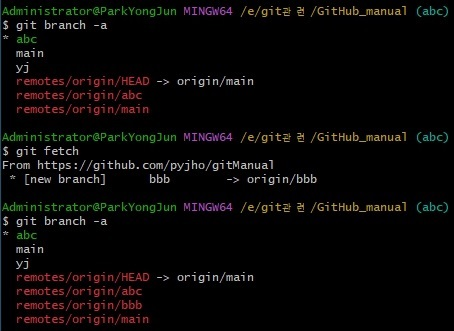
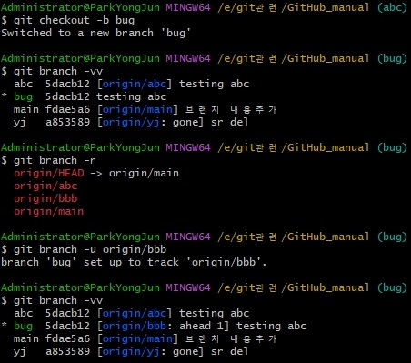

- **init 하면서 브랜치 생성**
```bash
 git -c init.defaultBranch=main init
 ```
 명령어를 풀어보면 이렇게 됩니다:
 git init
 새로운 Git 저장소를 초기화하는 기본 명령어예요. 실행하면 .git 디렉토리가 생성되고, 해당 디렉토리가 Git 저장소로 인식됩니다.

 <font color="gree">-c init.defaultBranch=main </font>
 
 git 실행 시 임시로 특정 설정(config)을 적용하는 옵션입니다. 
 여기서는  <font color="gree">init.defaultBranch=main</font> 설정을 적용한 것이고, 이는 초기화될 때 기본 브랜치 이름을 main으로 하라는 의미입니다.

Git 2.28 버전 이후부터는 기본 브랜치 이름이 master 대신 main으로 바뀌는 추세인데, 아직 환경에 따라 master로 만들어지는 경우가 있습니다.
이때  <font color="green">-c init.defaultBranch=main</font>을 붙이면, 전역 설정을 바꾸지 않고도 딱 이번 init 실행에 한해 main 브랜치를 기본 브랜치로 생성하게 됩니다.

<br>

- **브랜치 생성 후 체크아웃**
   - 위 두가지 기능을 한번에. 즉, 브랜치를 생성하고 체크아웃하는 기능을 의미 
  ```bash
  git checkout -b A main
          =
  git branch A main # main 브랜치를 기반으로 A 브랜치 생성
  git checkout A    # A브랜치로 이동
  ```
    - 로컬에 생성된 브랜치를 원격으로 전송 
  ```bash
  git push -u origin 브랜치명
  ``` 

- 특정 커밋시점으로 파일 되돌리기
  ```bash
  git checkout HEAD~1 index.html # 1커밋 전으로 되돌리기
  ```
 

- **현재 체크아웃된 브랜치명을 강제로 main으로 변경**

  ```bash
  git branch -M main
  ```
- **branch 삭제**
  - 로컬 브랜치  
  ```bash
  git branch -D 브랜치이름  # 강제삭제
  ```
  - 원격 브랜치
  ```bash
  git push origin --delete 브랜치이름  
  ```
  <font color=red>현재 체크아웃중인 브랜치에서는 삭제 불가. 다른 브랜치로 체크아웃 후 삭제가능</Font>

- **브랜치 상세내용 확인**
  ```bash
  git branch -v  
  ```
- **이전 브랜치로 이동 (checkout)**
  ```bash
  git branch -  # 브랜치 이동시 현재 작업중인 워킹디렉토리를 정리해야 함
  ```
- **출력될 커밋갯수 제한**
  ```bash
  git show-branch --more=10 # 커밋갯수 10개만 조회함.
  ```

- **브랜치의 마지막 커밋 Hash 조회**
  ```bash
  git rev-parse 브랜치명 # 해당 브랜치의 마지막 커밋의 Hash값 (HEAD)
  ```


- **브랜치 확인**
  ```bash
  git branch    # 로컬브랜치 확인
  git branch -r # 원격브랜치 확인 
  ```
    

  로컬 브랜치 + 원격브랜치 정보 모두 조회
    

- **브랜치의 트래킹 정보조회**
  ```bash
  git branch -vv    # 원격의 어떤 브랜치와 연결되는지에 대한 정보
  ```
    
    

- **원격 브랜치 복사**

  원격 저장소와 로컬 저장소의 브랜치 목록은 서로 다를 수 있음. 다른 개발자가 원격 저장소에 새로운 리모트 브랜치를 생성할 수 있기 때문임. 이렇게 생성된 원격 저장소의 리모트 브랜치를 이용해서 로컬 저장소에도 새로운 브랜치를 생성하여 동기화할 수 있음.

  ```bash
  git checkout -b 새이름 origin/브랜치이름
  ```

  ```bash
  git fetch       # 원격 저장소의 브랜치 정보를 받아옴.
  git branch -r   # 원격 브랜치 확인
  git checkout -b aaa origin/aaa # 원격브랜치를 기반으로 로컬저장소에 aaa 브랜치 생성   
  ```

- **업스트림 연결**

  기존에 있는 브랜치를 업스트림으로 직접 설정할 수 있음. 브랜치를 생성 후 직접 트래킹 브랜치를 지정할 수 있음. 업스트림을 직접 설정하면 원격 저장소로 트래킹 브랜치가 설정됨.

  ```bash
  git branch -u origin/브랜치이름
  ```
  -u 옵션은 --set-upstream-to의 약자.

   - 원격 저장소에 브랜치 생성

        
   - 원격 저장소의 생성된 브랜치를 가져옴 (Fetch)
   
        

   - bug 브랜치 생성 후 원격 저장소 origin/bbb를 업스트림 설정함

        
