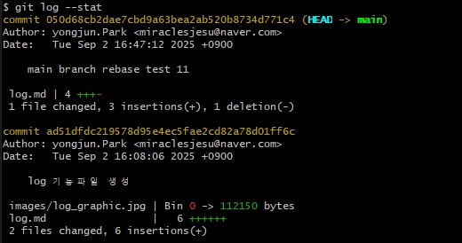

- git 커밋내역을 그래픽화
```bash
git log --oneline --graph --decorate --all
```

 


- 간략 로그
```bash
git log --pretty=short
```

- 특정 커밋의 상세정보
```bash
git show 커밋ID
```

- 특정 파일의 로그조회
```bash
git log 파일명
```

- 로그명령어 옵션
```bash
 1) git log --stat : 히스토리를 출력
 2) git log --pretty=oneline : 각 커밋을 한줄로 보여줌
```

 <br>
(1) HEAD 커밋에서 <font color=green>+++</font> 3개의 수정내역과 <font color=red>-</font> 1개의 삭제 내역이 있음을 보여줌.
 

(2) 커밋내역을 한줄로 표시