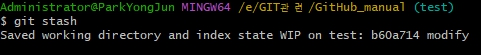
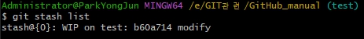

- stash (임시저장)

   현재 브랜치의 워킹 디렉토리에서 수정중인 파일이 있거나 Clean하지 않은 경우 다른 브랜치로 체크아웃을 할 수 없음.
   그런 경우 현재 수정중이 내용을 임시 저장소로 이동시키고 이전 마지막 커밋으로 되돌려서
   체크아웃을 할 수 있음. 또한 현재 브랜치에서 수정중인데 긴급히 운영에 반영해야 할 
   경우 임시 저장소로 수정중인 파일들을 이동시키고 처리할 수 있음.

   ```bash
   git stash
   git stash save "메시지" 
   ```
    <br>

- stash 목록 조회
   ```bash
   git stash list 
   ```
   <br>

- stash 가져오기 
  
  stash 는 스택(FILO: First in Last out) 구조로서 나중에 입력된 내용이 먼저 나옴.
   ```bash
   git stash pop 
   ```
  <font color=yellow> pop는 스택에서 저장 항목을 가져오는 동시에 저장된 항목을 삭제함. </font>

- stash 복사
   ```bash
   git stash apply             # 특정 스태시 번호를 명시하지 않으면 최신 스태시로 복원
   git stash apply stash@{1}   # 스태시 번호를 이용하여 복원
   ```   
  <font color=yellow> apply는 스택에서 저장 항목을 삭제하지않고 복사함. </font>

   ```bash
   git stash apply --index    
   ```   
   <font color=yellow>
   스태시는 스택에 저장할 때 워킹 디렉토리와 스테이지 영역의 파일까지 모두 보관함.
   스태시로 복원할 때는 워킹 디렉토리만 되돌려 놓음. 스테이지에 등록된 스테이지 상태
   까지 복구하길 원한다면 --index 옵션을 사용해야 함.
   </font>
   
   <br>
- stash 삭제
   ```bash
   git stash drop
   ```

- 브랜치 생성 후 stash 적용 
  ```bash
   git stash branch 브랜치이름
  ```
  <font color=yellow>
  스태시 스택에 저장된 내용으로 브랜치 생성되고 스태시 스택에서 자동삭제됨.
  </font>