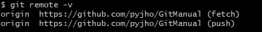

### 1. 원격저장소 
- 로컬 저장소와 원격 저장소 연결
```bash
git remote add origin 깃주소.git
```
- 원격 저장소 연결 끊기
```bash
git remote remove origin
```

- 원격 저장소 복제
```bash
git clone 깃주소.git
```

- 연결된 원격 저장소 조회
```bash
git remote -v
```

 