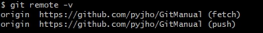

### 1. 원격저장소 
- 로컬 저장소와 원격 저장소 연결
```bash
git remote add origin 깃주소.git
```
<font color=yellow> origin 은 원격 저장소의 별칭으로서 깃주소를 대체함.</font>

- 별칭 이름 변경
```bash
git remote rename 변경전 변경후
```
- 원격 저장소의 상세한 정보 조회

```bash
git remote show 원격저장소 별칭
```
 

- 원격 저장소 연결 끊기
```bash
git remote remove 원격저장소 별칭 # origin
git remote rm 원격저장소 별칭     # origin
```

- 원격 저장소 복제
```bash
git clone 깃주소.git
```

- 연결된 원격 저장소 조회
```bash
git remote -v
```

 