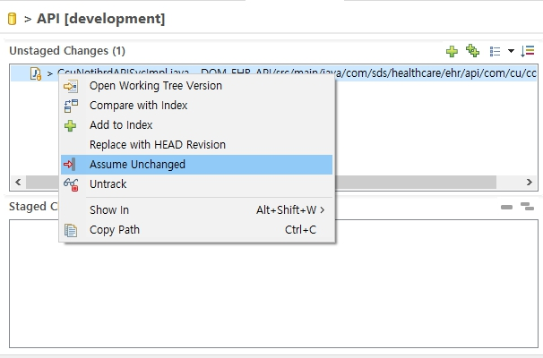

### 1. 기본개념
Git은 워킹 디렉토리(Working Directory), 스테이징 영역(Index), 저장소(Repository)의 세 부분을 관리합니다.
일반적으로 Git은 모든 추적 중인(tracked) 파일의 변경 여부를 자동 감지합니다.
그런데 특정 파일의 변경을 무시하고 싶을 때 <font color=yellow>git update-index </font>옵션을 사용합니다.

- 변경내역 추적하지 않기 (<font color=yellow>--assume-unchanged </font>)
```bash
git update-index --assume-unchanged mapper-XraSrrqMngmDAO.xml
# mapper-XraSrrqMngmDAO.xml 파일이 수정되어도 추적하지 않기때문에 반영할 수 없음
```
이클립스에서 git unstaged changes 영역에서 우클릭 메뉴 "Assume unchanged" 클릭 시 제외처리됨.  <br><font color= gree> [아래 이미지 참고] </font> 

 

- 추적 상태로 변경하기 (<font color= yellow> --no-assume-unchanged </font>)
```bash
git update-index --no-assume-unchanged mapper-XraSrrqMngmDAO.xml
```